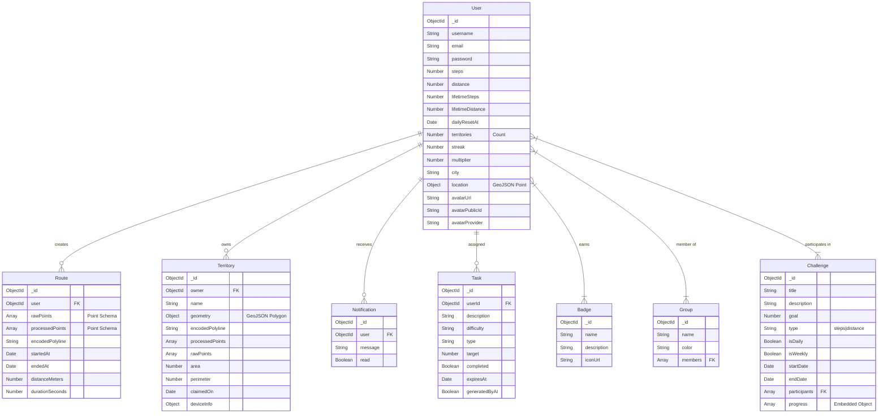
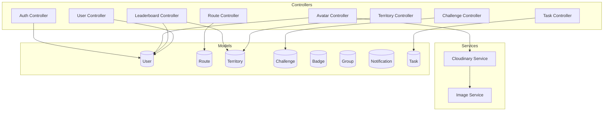

# Runiverse Backend Architecture & Schema

This document outlines the database schema, backend architecture, and aggregation pipelines for the Runiverse application.

## 1. Database Schema (ER Diagram)

This diagram represents the Mongoose schemas and their relationships.



## 2. Backend Architecture & Connections

This diagram shows how Controllers interact with Services and Models.



## 3. MongoDB Aggregation Pipelines

This diagram details the complex aggregation logic found in `leaderboardController.js`.

```mermaid
flowchart TD
    subgraph Leaderboard_Logic [Leaderboard & Stats Aggregation]
        start([Request: getCityLeaderboard])
        
        subgraph Step1_UserQuery [1. Filter Users by City]
            q1[User.find]
            q1_filter[Filter: { city: regex }]
            q1_proj[Select: username, avatar, stats]
            q1_limit[Limit: 25]
            
            q1 --> q1_filter --> q1_proj --> q1_limit
        end

        subgraph Step2_TerritoryAgg [2. Aggregate Territory Stats]
            agg_start[Territory.aggregate]
            
            stage1[Stage 1: $match]
            stage1_desc[Match territories where owner is in the User list]
            
            stage2[Stage 2: $group]
            stage2_desc["_id: '$owner'<br/>totalArea: { $sum: '$metrics.area' }<br/>territoryCount: { $sum: 1 }"]
            
            agg_start --> stage1 --> stage1_desc --> stage2 --> stage2_desc
        end

        start --> Step1_UserQuery
        Step1_UserQuery -->|List of Users| Step2_TerritoryAgg
        Step2_TerritoryAgg -->|Stats Map| merge[Merge User Data + Territory Stats]
        merge --> finish([Return JSON Response])
    end
```
